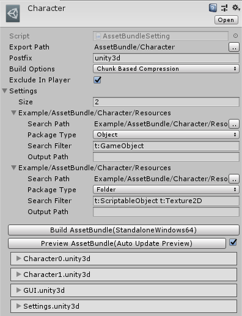
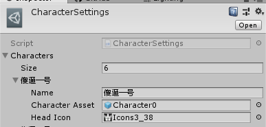

# AssetBundle
* AssetBundle资源包配置



* 加载AssetBundle资源
```cs
AssetBundleLoader.Instance.AttachAssetBundleInfoByFilePath("AssetBundle/Character");

// :Assets/Example/AssetBundle/Character/Resources/Character0.prefab
// :AssetBundle/Character/Windows/character0.unity3d:Character0
// Assets/Example/AssetBundle/Scripts/AssetBundleMain.cs
var rRequest = AssetLoader.LoadAsync<GameObject>("Character0");
yield return rRequest;

var rCharacterInstance = Instantiate(rRequest.Asset, null);
```

* 关键AssetBundle中的资源与Resources中的资源

```cs
// Assets/Example/AssetBundle/Scripts/CharacterSettings.cs
// RGameObject CharacterAsset;

var rRequest = CharacterAsset.LoadAsync();
yield return rRequest;

var rCharacterInstance = Instantiate(rRequest.Asset, null);
```


# Bug
* `AssetLoader.LoadAsset("Character0", typeof(GameObject))`多调用几次AssetBundle不支持多次加载Prefab